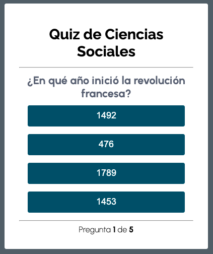

# Información
Esta sencilla app es un quiz cuyas preguntas abordan temas relacionados a las **Ciencias Sociales**, elaborada con el fin de practicar **Programación orientada a Objetos** en JavaScript, utilizando el [video tutorial](https://www.youtube.com/watch?v=t_2PI3fHp_I) de youtuber **Fazt** (La app tiene algunas leves variaciones con respecto al video tutorial del youtuber ya mencionado).

Principalmente se ha implementado:

- Vanilla CSS
- Vanillla JavaScript
- POO: Objetos literales, Clases, Propiedades y Métodos
- Manipulación del DOM
- Módulos JavaScript: Import & Export
- Documentación del códico con JSDocs 

### Vista:
